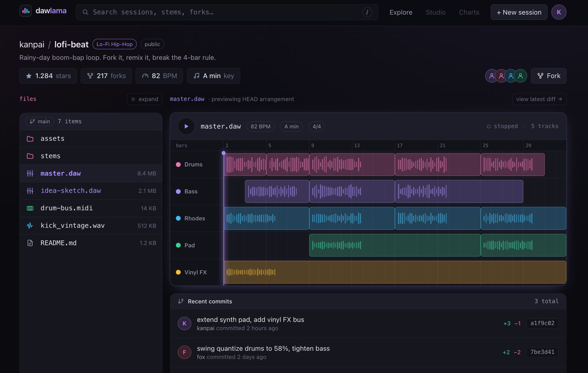
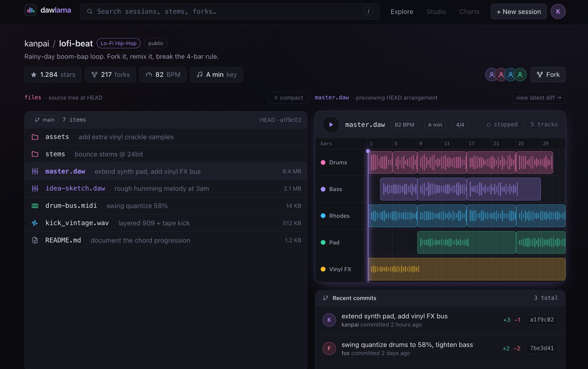
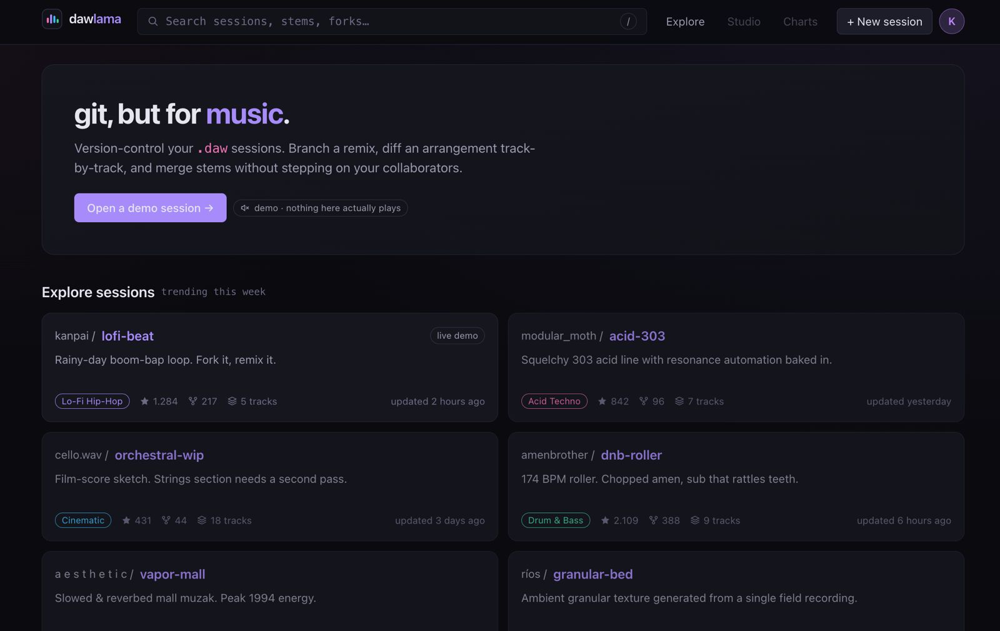
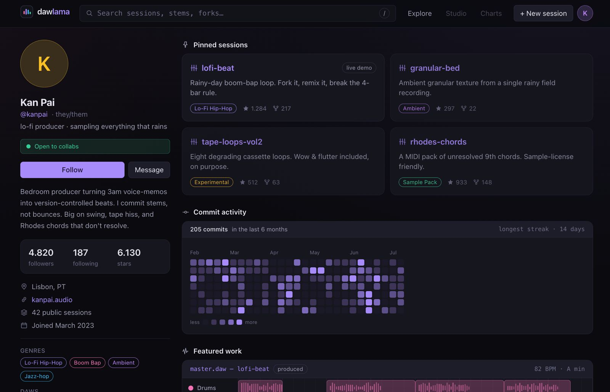

# dawlama
> Github desc: Dawlama [Concept], collaborative version control for music. Explore sessions, inspect commits, star projects.

**git, but for music.** Version-control your `.daw` sessions — branch a remix, diff an arrangement track-by-track, and merge stems without stepping on your collaborators. It's a GitHub-style UI (explore page, repo view, commit diffs, user profiles) built for a domain git was never designed for: instead of diffing text lines, it diffs track regions, gain, and mix metadata across a session's history.




  


> ⚠️ Demo only. Everything is mocked: nothing plays, nothing saves, no real git runs. All content comes from [app/data/mock.ts](app/data/mock.ts) — edit it to change what the demo shows. 
> 
## Installation

```sh
npm install
```

## Usage example

```sh
npm run dev
```

Open http://localhost:3000. From there:

| Path | What |
|---|---|
| `/` | Explore — trending sessions |
| `/r/[repo]` | Session page: hero timeline, file tree, commits, readme |
| `/r/[repo]/commit/[sha]` | Commit diff — before/after arrangement, track by track |
| `/u/[user]` | User profile |
| `/stars` | Starred sessions (client-side, in-memory) |

## Development setup

Built with Next.js 15 (App Router), React 19, TypeScript, and Tailwind CSS 4.

```sh
npm run dev     # dev server
npm run build   # production build
npm run lint    # eslint
```

Layout:

```
app/
  components/   UI: Timeline, TrackLanes, CommitList, FileTree, RepoCard, …
  data/mock.ts  all the fake repos, tracks, commits
  lib/stars.tsx star state (React context)
```
